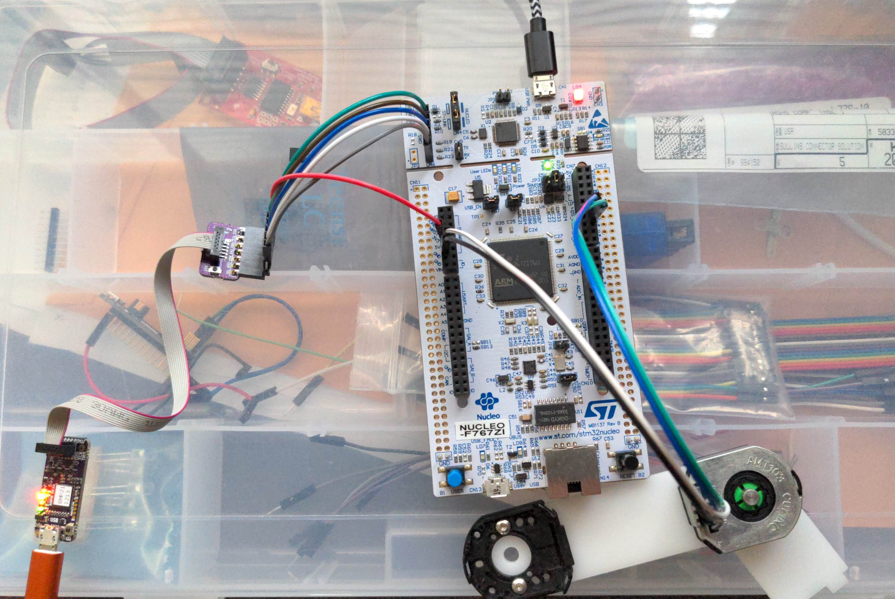

## Encoder Example

Connect a quadrature encoder to the Nucleo.
Some of ST's timer peripherals feature a built in encoder-counter feature.
This feature completely decouples having to count encoder steps using the processor, leaving the count in a register for you to read on a whim.

## Wiring

### Nucleo Setup
Remove JP6 (jumper pin 6) to disconnect some other clashing signals on PA7.


Keep both device jumpers set to the Nucleo.

## Wiring the Black Magic Probe
The Black Magic Probe can program devices over either JTAG or ST's Serial Wire Debugger Protocol.
You can connect your BMP to the Nucleo's SWD Pins like so:
| SWD Name   | JTAG Name | Note                                                            |   |
|------------|-----------|-----------------------------------------------------------------|---|
| VCC Target | VCC       | VCC of the **Program Target** such that the BMP can measure it. |   |
| SWDCLK     | TCK       |                                                                 |   |
| GND        | GND       |                                                                 |   |
| SWDIO      | TMS       |                                                                 |   |
| RST        | RST       |                                                                 |   |
| SWO        | TDO       |                                                                 |   |
Note that *VCC Target* needs to be connected to any 3v3 pin on the Nucleo, but it can't be connected to pin 1 on the CN6 header.

Possibly the easiest way to setup a connection is to use the [JTAG/SWD 0.1in. Breakout Adaptor Board](https://1bitsquared.com/collections/accessories/products/jtag-swd-100mil-pitch-breakout).
Here's one valid setup.


All connections except *Vcc Target* should be a straight shot into the Nucleo SWD header on the Nucleo.

## Setting up the toolchain
Install the arm toolchain (compiler etc) for Ubuntu:
```
sudo apt-get install gcc-arm-none-eabi
```
Add the [Black Magic UDev Rules](../bringup/99-blackmagic.rules) file to your udev rules.
(i.e: place them in the /etc/udev/rules.d directory.)
You may need sudo permissions to put the file there.

These rules will label the BMP's two ports to */dev/BmpTarg* and */dev/BmpGdb*.

Reload the rules with
```
sudo udevadm control --reload-rules
```
You may need to unplug the BMP and then plug it back in for the name change to take affect.

Finally, install [libopencm3](https://github.com/libopencm3/libopencm3), and compile it.

## Compiling and flashing
Compile the code:
```
make
```

## Flashing the Code
If you want to simply upload the code, use:
```
make bmp-flash
```

### Debugging Interactively
If you want to debug the code interactively, you must connect manually.
```
arm-none-eabi-gdb nucleo_767_encoder_example.elf
target extended-remote /dev/ttyBmpGdb
monitor swdp_scan
attach 1
load
run
```
